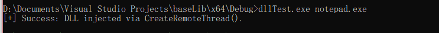
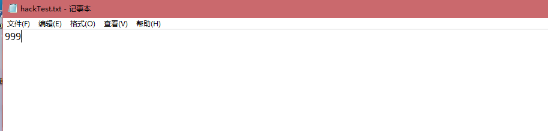

## 实验内容
使用 DLL 注入技术（CreateRemoteThread），将自己编写的 DLL 注入到 notepad 中。注入成功后 DLL 会运行其 DllMain 函数，在该函数运行时，Dll 会使用IATHook 技术，将 notepad 进程中存放 Kernel32.dll WriteFile 函数地址的字段改会自己写的 Fake_WriteFile 函数的地址。在 Fake_WriteFile 中，检测如果要保存的内容为 666 ，将之修改为 999。
## 源码
### Fake_WriteFile （在检测到保存内容为 666 时将之修改为 999）
``` C
BOOL __stdcall Fake_WriteFile(
    HANDLE       hFile,
    LPCVOID      lpBuffer,
    DWORD        nNumberOfBytesToWrite,
    LPDWORD      lpNumberOfBytesWritten,
    LPOVERLAPPED lpOverlapped
)
{
    LPFN_WriteFile fnOrigin = (LPFN_WriteFile)GetIATHookOrign(g_hHook_WriteFile);
    
    if (!strcmp(lpBuffer, "666"))
    {
        return fnOrigin(hFile, "999", nNumberOfBytesToWrite, lpNumberOfBytesWritten, lpOverlapped);
    }

    return fnOrigin(hFile, lpBuffer, nNumberOfBytesToWrite, lpNumberOfBytesWritten, lpOverlapped);
}

```
### IATHook.c (修改自 https://github.com/tinysec/iathook)
``` C
// windows IATHook for kernelmode and usermode 
// by TinySec( root@tinysec.net )
// you can free use this code , but if you had modify , send a copy to to my email please.

#ifdef _RING0
	#include <ntddk.h>
	#include <ntimage.h>
#else
	#include <windows.h>
	#include <stdlib.h>
#endif //#ifdef _RING0

typedef struct _IATHOOK_BLOCK
{
	void*	pOrigin;

	void*	pImageBase;
	char*	pszImportDllName;
	char*	pszRoutineName;

	void*	pFake;
	
}IATHOOK_BLOCK;

void* _IATHook_Alloc(__in ULONG nNeedSize)
{
	void* pMemory = NULL;

	do 
	{
		if ( 0 == nNeedSize )
		{
			break;
		}
		
#ifdef _RING0
		pMemory = ExAllocatePoolWithTag( NonPagedPool , nNeedSize , 'iath' );

#else
		pMemory = malloc( nNeedSize );
#endif // #ifdef _RING0
		
		if ( NULL == pMemory )
		{
			break;
		}

		RtlZeroMemory( pMemory , nNeedSize );

	} while (FALSE);

	return pMemory;
}


ULONG _IATHook_Free(__in void* pMemory )
{

	do 
	{
		if ( NULL == pMemory )
		{
			break;
		}
		
#ifdef _RING0
		ExFreePool( pMemory );
		
#else
		free( pMemory );
#endif // #ifdef _RING0
		
		pMemory = NULL;
		
	} while (FALSE);
	
	return 0;
}

#ifdef _RING0


#ifndef LOWORD
	#define LOWORD(l)           ((USHORT)((ULONG_PTR)(l) & 0xffff))
#endif // #ifndef LOWORD


void*  _IATHook_InterlockedExchangePointer(__in void* pAddress , __in void* pValue )
{
	void*	pWriteableAddr=NULL;
	PMDL	pNewMDL = NULL;
	void*	pOld =  NULL;
	
	do 
	{
		if (  (NULL == pAddress)  )
		{
			break;
		}
		
		if ( !NT_SUCCESS(MmIsAddressValid(pAddress)) )
		{
			break;
		}
		
		pNewMDL = IoAllocateMdl(pAddress , sizeof(void*) , FALSE , FALSE , NULL);
		if (pNewMDL == NULL)
		{
			break;
		}
		
		__try
		{
			MmProbeAndLockPages(pNewMDL, KernelMode, IoWriteAccess);
			
			pNewMDL->MdlFlags |= MDL_MAPPING_CAN_FAIL;
			
			pWriteableAddr = MmMapLockedPagesSpecifyCache(
					pNewMDL ,
					KernelMode ,
					MmNonCached ,
					NULL ,
					FALSE ,
					HighPagePriority 
			);

			//pWriteableAddr = MmMapLockedPages(pNewMDL, KernelMode);
		}
		__except(EXCEPTION_EXECUTE_HANDLER)
		{
			break;
		}
		
		if (pWriteableAddr == NULL) 
		{
			MmUnlockPages(pNewMDL);
			IoFreeMdl(pNewMDL);
			
			break;
		}
		
		pOld = InterlockedExchangePointer( pWriteableAddr , pValue);
		
		MmUnmapLockedPages(pWriteableAddr,pNewMDL);
		MmUnlockPages(pNewMDL);
		IoFreeMdl(pNewMDL);
		
	} while (FALSE);
	
	return pOld;
}

#else

void*  _IATHook_InterlockedExchangePointer(__in void* pAddress , __in void* pValue )
{
	void*	pWriteableAddr=NULL;
	void*	nOldValue =  NULL;
	ULONG	nOldProtect = 0;
	BOOL	bFlag = FALSE;
	
	do 
	{
		if (  (NULL == pAddress)  )
		{
			break;
		}
		
		bFlag = VirtualProtect( pAddress , sizeof(void*) , PAGE_EXECUTE_READWRITE , &nOldProtect );
		if ( !bFlag )
		{
			break;
		}
		pWriteableAddr = pAddress;
		
		nOldValue = InterlockedExchangePointer( pWriteableAddr , pValue );
		
		VirtualProtect( pAddress , sizeof(void*) , nOldProtect , &nOldProtect );
		
	} while (FALSE);
	
	return nOldValue;
}

#endif // #ifdef _RING0


LONG _IATHook_Single
(
	__in IATHOOK_BLOCK*	pHookBlock ,
	__in IMAGE_IMPORT_DESCRIPTOR*	pImportDescriptor ,
	__in BOOLEAN bHook
)
{
	LONG				nFinalRet = -1;

	IMAGE_THUNK_DATA*	pOriginThunk = NULL;
	IMAGE_THUNK_DATA*	pRealThunk = NULL;

	IMAGE_IMPORT_BY_NAME*	pImportByName = NULL;

	do 
	{
		pOriginThunk = (IMAGE_THUNK_DATA*)( (UCHAR*)pHookBlock->pImageBase + pImportDescriptor->OriginalFirstThunk );
		pRealThunk = (IMAGE_THUNK_DATA*)( (UCHAR*)pHookBlock->pImageBase + pImportDescriptor->FirstThunk );

		for ( ;  0 != pOriginThunk->u1.Function; pOriginThunk++ , pRealThunk++ )
		{
			if ( IMAGE_ORDINAL_FLAG == ( pOriginThunk->u1.Ordinal & IMAGE_ORDINAL_FLAG ) )
			{
				if ( (USHORT)pHookBlock->pszRoutineName == LOWORD( pOriginThunk->u1.Ordinal) )
				{
					if ( bHook )
					{
						pHookBlock->pOrigin = (void*)pRealThunk->u1.Function;
						_IATHook_InterlockedExchangePointer( (void**)&pRealThunk->u1.Function , pHookBlock->pFake );
					}
					else
					{
						_IATHook_InterlockedExchangePointer( (void**)&pRealThunk->u1.Function , pHookBlock->pOrigin );
					}

					nFinalRet = 0; 
					break;
				}
			}
			else
			{
				pImportByName = (IMAGE_IMPORT_BY_NAME*)( (char*)pHookBlock->pImageBase + pOriginThunk->u1.AddressOfData );

				if ( 0 == _stricmp( pImportByName->Name ,  pHookBlock->pszRoutineName ) )
				{	
					if ( bHook )
					{
						pHookBlock->pOrigin = (void*)pRealThunk->u1.Function;
						_IATHook_InterlockedExchangePointer( (void**)&pRealThunk->u1.Function , pHookBlock->pFake );
					}
					else
					{
						_IATHook_InterlockedExchangePointer( (void**)&pRealThunk->u1.Function , pHookBlock->pOrigin );
					}

					nFinalRet = 0;

					break;
				}
			}

		}
		
	} while (FALSE);

	return nFinalRet;
}


LONG _IATHook_Internal( __in IATHOOK_BLOCK* pHookBlock , __in BOOLEAN bHook)
{
	LONG				nFinalRet = -1;
	LONG				nRet = -1;
	IMAGE_DOS_HEADER*	pDosHeader = NULL;
	IMAGE_NT_HEADERS*	pNTHeaders = NULL;

	IMAGE_IMPORT_DESCRIPTOR*	pImportDescriptor = NULL;
	char*						pszImportDllName = NULL;

	
	do 
	{
		if ( NULL == pHookBlock )
		{
			break;
		}
		
		pDosHeader = (IMAGE_DOS_HEADER*)pHookBlock->pImageBase;
		if ( IMAGE_DOS_SIGNATURE != pDosHeader->e_magic )
		{
			break;
		}
		
		pNTHeaders = (IMAGE_NT_HEADERS*)( (UCHAR*)pHookBlock->pImageBase + pDosHeader->e_lfanew );
		if ( IMAGE_NT_SIGNATURE != pNTHeaders->Signature )
		{
			break;
		}
		
		if ( 0 == pNTHeaders->OptionalHeader.DataDirectory[IMAGE_DIRECTORY_ENTRY_IMPORT].VirtualAddress )
		{
			break;
		}
		
		if ( 0 == pNTHeaders->OptionalHeader.DataDirectory[IMAGE_DIRECTORY_ENTRY_IMPORT].Size )
		{
			break;
		}
		
		pImportDescriptor = (IMAGE_IMPORT_DESCRIPTOR*)( (UCHAR*)pHookBlock->pImageBase + pNTHeaders->OptionalHeader.DataDirectory[IMAGE_DIRECTORY_ENTRY_IMPORT].VirtualAddress );
		
		
		// Find pszRoutineName in every Import descriptor
		nFinalRet = -1;

		for (  ;  (pImportDescriptor->Name != 0 );  pImportDescriptor++ )
		{
			pszImportDllName = (char*)pHookBlock->pImageBase + pImportDescriptor->Name;

			if ( NULL != pHookBlock->pszImportDllName )
			{
				if ( 0 != _stricmp(pszImportDllName , pHookBlock->pszImportDllName) )
				{
					continue;
				}
			}
			
			nRet = _IATHook_Single(
				pHookBlock,
				pImportDescriptor,
				bHook
			);
			
			if ( 0 == nRet )
			{
				nFinalRet = 0;
				break;
			}
		}
			
	} while (FALSE);
	
	return nFinalRet;
}

LONG IATHook
(
	__in void* pImageBase ,
	__in_opt char* pszImportDllName ,
	__in char* pszRoutineName ,
	__in void* pFakeRoutine ,
	__out HANDLE* Param_phHook
)
{
	LONG				nFinalRet = -1;
	IATHOOK_BLOCK*		pHookBlock = NULL;
	
	
	do 
	{
		if ( (NULL == pImageBase) || (NULL == pszRoutineName) || (NULL == pFakeRoutine) )
		{
			break;
		}
		
		pHookBlock = (IATHOOK_BLOCK*)_IATHook_Alloc( sizeof(IATHOOK_BLOCK) );
		if ( NULL == pHookBlock )
		{
			break;
		}
		RtlZeroMemory( pHookBlock , sizeof(IATHOOK_BLOCK) );
		
		pHookBlock->pImageBase = pImageBase;
		pHookBlock->pszImportDllName = pszImportDllName;
		pHookBlock->pszRoutineName = pszRoutineName;
		pHookBlock->pFake = pFakeRoutine;
		
		__try
		{
			nFinalRet = _IATHook_Internal(pHookBlock , TRUE);
		}
		__except(EXCEPTION_EXECUTE_HANDLER)
		{
			nFinalRet = -1;
		}
		
	} while (FALSE);
	
	if ( 0 != nFinalRet )
	{
		if ( NULL != pHookBlock )
		{
			_IATHook_Free( pHookBlock );
			pHookBlock = NULL;
		}
	}

	if ( NULL != Param_phHook )
	{
		*Param_phHook = pHookBlock;
	}

	return nFinalRet;
}

LONG UnIATHook( __in HANDLE hHook )
{
	IATHOOK_BLOCK*		pHookBlock = (IATHOOK_BLOCK*)hHook;
	LONG				nFinalRet = -1;

	do 
	{
		if ( NULL == pHookBlock )
		{
			break;
		}
		
		__try
		{
			nFinalRet = _IATHook_Internal(pHookBlock , FALSE);
		}
		__except(EXCEPTION_EXECUTE_HANDLER)
		{
			nFinalRet = -1;
		}
			
	} while (FALSE);

	if ( NULL != pHookBlock )
	{
		_IATHook_Free( pHookBlock );
		pHookBlock = NULL;
	}

	return nFinalRet;
}

void* GetIATHookOrign( __in HANDLE hHook )
{
	IATHOOK_BLOCK*		pHookBlock = (IATHOOK_BLOCK*)hHook;
	void*				pOrigin = NULL;
	
	do 
	{
		if ( NULL == pHookBlock )
		{
			break;
		}
		
		pOrigin = pHookBlock->pOrigin;
			
	} while (FALSE);
	
	return pOrigin;
}

```
### Dll 内容 （在 DLL ATTACH 时进行 Hook）
``` C
HANDLE g_hHook_WriteFile = NULL;

typedef int(__stdcall* LPFN_WriteFile)(
    HANDLE       hFile,
    LPCVOID      lpBuffer,
    DWORD        nNumberOfBytesToWrite,
    LPDWORD      lpNumberOfBytesWritten,
    LPOVERLAPPED lpOverlapped
    );

BOOL WINAPI DllMain(
    HINSTANCE hinstDLL,  // handle to DLL module
    DWORD fdwReason,     // reason for calling function
    LPVOID lpReserved)  // reserved
{
    // Perform actions based on the reason for calling.
    switch (fdwReason)
    {
    case DLL_PROCESS_ATTACH:
        // Initialize once for each new process.
        // Return FALSE to fail DLL load.
        hookWriteFile();
        break;

    case DLL_THREAD_ATTACH:
        // Do thread-specific initialization.
        break;

    case DLL_THREAD_DETACH:
        // Do thread-specific cleanup.
        break;

    case DLL_PROCESS_DETACH:
        // Perform any necessary cleanup.
        break;
    }
    return TRUE;  // Successful DLL_PROCESS_ATTACH.
}
```

### 主程序（通过 CreateRemoteThread 将 DLL 通过进程名注入到指定进程中）（修改自 https://github.com/fdiskyou/injectAllTheThings/blob/master/injectAllTheThings/t_CreateRemoteThread.cpp）
``` C
#include <stdio.h>
#include <wtypes.h>
#include <TlHelp32.h>

void EnableDebugPriv();
DWORD findPidByName(char* pname);
DWORD injectDLL(const char* strDLLPath, DWORD dwProcessId);

DWORD main(int argc, char* argv[])
{
	EnableDebugPriv();

	// 得到进程名
	char *strProcName;
	strProcName = argv[1];

	// 要注入的 DLL 路径
	const char *strDLLPath = "D:\\Documents\\Visual Studio Projects\\baseLib\\x64\\Debug\\baseLib.dll";

	// 获取进程的 pid
	DWORD dwPid = findPidByName(strProcName);
	if (dwPid == 0)
	{
		printf_s("Can't Find Pid.\n");
		return 1;
	}

	injectDLL(strDLLPath, dwPid);

	return 0;
}

DWORD findPidByName(char *pname)
{
	HANDLE h;
	PROCESSENTRY32 procSnapshot;
	h = CreateToolhelp32Snapshot(TH32CS_SNAPPROCESS, 0);
	procSnapshot.dwSize = sizeof(PROCESSENTRY32);

	do
	{
		if (!strcmp(procSnapshot.szExeFile, pname))
		{
			DWORD pid = procSnapshot.th32ProcessID;
			CloseHandle(h);
			return pid;
		}
	} while (Process32Next(h, &procSnapshot));

	CloseHandle(h);
	return 0;
}

DWORD injectDLL(const char* strDLLPath, DWORD dwProcessId)
{
	// Calculate the number of bytes needed for the DLL's pathname
	DWORD dwSize = (strlen(strDLLPath) + 1) * sizeof(char);

	// Get process handle passing in the process ID
	HANDLE hProcess = OpenProcess(
		PROCESS_QUERY_INFORMATION |
		PROCESS_CREATE_THREAD |
		PROCESS_VM_OPERATION |
		PROCESS_VM_WRITE,
		FALSE, dwProcessId);
	if (hProcess == NULL)
	{
		printf("[-] Error: Could not open process for PID (%d).\n", dwProcessId);
		return(1);
	}

	// Allocate space in the remote process for the pathname
	LPVOID pszLibFileRemote = VirtualAllocEx(hProcess, NULL, dwSize, MEM_COMMIT, PAGE_READWRITE);
	if (pszLibFileRemote == NULL)
	{
		printf("[-] Error: Could not allocate memory inside PID (%d).\n", dwProcessId);
		return(1);
	}

	// Copy the DLL's pathname to the remote process address space
	DWORD n = WriteProcessMemory(hProcess, pszLibFileRemote, (LPCVOID)strDLLPath, dwSize, NULL);
	if (n == 0)
	{
		printf("[-] Error: Could not write any bytes into the PID [%d] address space.\n", dwProcessId);
		return(1);
	}

	

	// Get the real address of LoadLibraryW in Kernel32.dll
	PTHREAD_START_ROUTINE pfnThreadRtn = (PTHREAD_START_ROUTINE)GetProcAddress(GetModuleHandle("Kernel32"), "LoadLibraryA");
	if (pfnThreadRtn == NULL)
	{
		printf("[-] Error: Could not find LoadLibraryA function inside kernel32.dll library.\n");
		return(1);
	}

	// Create a remote thread that calls LoadLibraryA(DLLPathname)
	HANDLE hThread = CreateRemoteThread(hProcess, NULL, 0, pfnThreadRtn, pszLibFileRemote, 0, NULL);
	if (hThread == NULL)
	{
		printf("[-] Error: Could not create the Remote Thread.\n");
		DWORD err = GetLastError();
		return(1);
	}
	else
		printf("[+] Success: DLL injected via CreateRemoteThread().\n");

	// Wait for the remote thread to terminate
	WaitForSingleObject(hThread, INFINITE);

	// Free the remote memory that contained the DLL's pathname and close Handles
	if (pszLibFileRemote != NULL)
		VirtualFreeEx(hProcess, pszLibFileRemote, 0, MEM_RELEASE);

	if (hThread != NULL)
		CloseHandle(hThread);

	if (hProcess != NULL)
		CloseHandle(hProcess);

	return(0);
}

void EnableDebugPriv()
{
	HANDLE hToken;
	LUID luid;
	TOKEN_PRIVILEGES tkp;

	OpenProcessToken(GetCurrentProcess(), TOKEN_ADJUST_PRIVILEGES | TOKEN_QUERY, &hToken);

	LookupPrivilegeValue(NULL, SE_DEBUG_NAME, &luid);

	tkp.PrivilegeCount = 1;
	tkp.Privileges[0].Luid = luid;
	tkp.Privileges[0].Attributes = SE_PRIVILEGE_ENABLED;

	AdjustTokenPrivileges(hToken, FALSE, &tkp, sizeof(tkp), NULL, NULL);

	CloseHandle(hToken);
}
```

## 实验过程 & 结果
1. 编译链接（略过w）（DLL 名为 baseLib.dll，主程序名为 dllTest.exe）（注：要生成 x64 架构的 Dll 和 主程序）
2. 运行 notepad，输入 666
3. 运行主程序：
   ``` bash
   dllTest.exe notepad.exe
   ```

4. 保存 notepad

### 结果
打开保存的文件，可以发现原本输入的 666 变为了 999。

