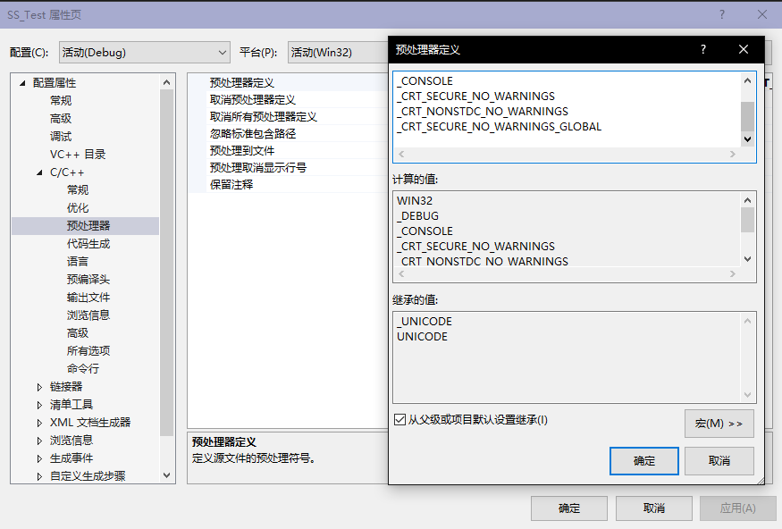
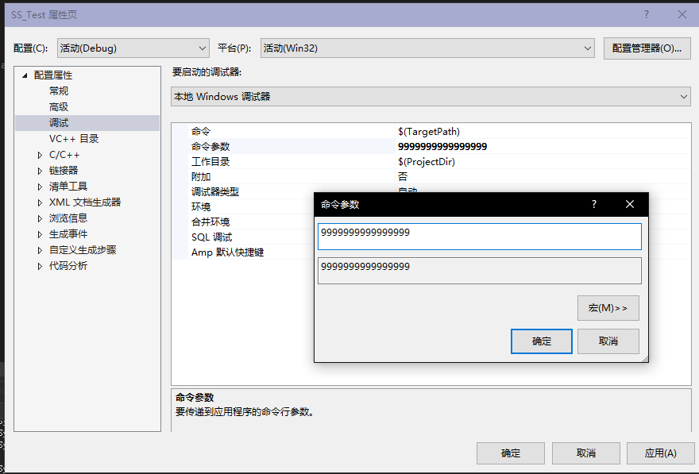
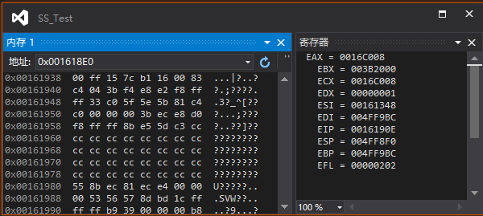
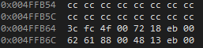
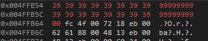

# 软件项目安全开发生命周期 缓冲区溢出实验
###### 17软工 刘明洋 201711143013
---

## 1. 准备工作
+ 用 Visual Studio 编写可能发生缓冲区溢出实验的 C 源码（此处是使用 `strcpy()` 函数）
+ 禁用 C 的安全检查
+ 在控制台参数中输入一个会使缓冲区溢出的参数
### 实验源码
``` C
#include<stdlib.h>
#include<stdio.h>
#include<string.h>

int sub(char* x) 
{
	char y[10];
	strcpy(y, x);
	return 0;
}

int main(int argc, char** argv) 
{
	if (argc > 1) 
	{
		sub(argv[1]);
	}
	printf("exit");
	system("pause");
}
```
#### 禁用 C 的安全检查
在 `项目属性 > 配置属性 > C/C++ > 预处理器 > 预处理器定义` 中，添加以下三条宏定义：
```
_CRT_SECURE_NO_WARNINGS
_CRT_NONSTDC_NO_WARNINGS
_CRT_SECURE_NO_WARNINGS_GLOBAL
```

再将各种检查关闭。
#### 设置命令行参数
在 `项目属性 > 配置属性 > C/C++ > 预处理器 > 预处理器定义` 中，添加一连串的 `'9'` 作为参数。  

  

## 2. 实验过程
+ 添加一个在 `sub(argv[1])` 处的断点，开始调试。
+ 转到反汇编，打开内存窗口和寄存器窗口。  


+ 有 `sub(argv[1])` 处的汇编代码：
```
00EB185E B8 04 00 00 00       mov         eax,4  
00EB1863 C1 E0 00             shl         eax,0  
00EB1866 8B 4D 0C             mov         ecx,dword ptr [ebp+0Ch]  
00EB1869 8B 14 01             mov         edx,dword ptr [ecx+eax]  
00EB186C 52                   push        edx  
00EB186D E8 0E FA FF FF       call        00EB1280  
00EB1872 83 C4 04             add         esp,4  
```
此处前4句将 `argv[1]` 所在的地址赋值给 `EDX` ，然后将 `EDX` 入栈作为函数的参数，此处即是栈帧的开始。之后用 `call` 调用函数 `sub` (即将`EIP`赋值为被调函数的起始地址，再将返回地址，即`call`的下一条指令地址入栈)
+ 来到`sub`函数处，有汇编代码：
```
00EB1970 55                   push        ebp  
00EB1971 8B EC                mov         ebp,esp  
00EB1973 81 EC D4 00 00 00    sub         esp,0D4h  
00EB1979 53                   push        ebx  
00EB197A 56                   push        esi  
00EB197B 57                   push        edi  
00EB197C 8D BD 2C FF FF FF    lea         edi,[ebp+FFFFFF2Ch]  
00EB1982 B9 35 00 00 00       mov         ecx,35h  
00EB1987 B8 CC CC CC CC       mov         eax,0CCCCCCCCh  
00EB198C F3 AB                rep stos    dword ptr es:[edi]  
00EB198E B9 06 C0 EB 00       mov         ecx,0EBC006h  
00EB1993 E8 84 F8 FF FF       call        00EB121C  
```
前2条语句将原函数的栈帧基址`EBP`压入栈中，然后将此时的栈顶地址`ESP`作为新的栈帧基址`EBP`。此时函数栈帧的准备工作（参数，返回到原函数的各种信息）完毕。  
之后的代码为函数运行前的一些准备，这里忽略。
+ 来到`char y[0];strcpy(y, x)`的汇编代码：
```
00EB1998 8B 45 08             mov         eax,dword ptr [ebp+8]  
00EB199B 50                   push        eax  
00EB199C 8D 4D F0             lea         ecx,[ebp-10h]  
00EB199F 51                   push        ecx  
00EB19A0 E8 B3 F8 FF FF       call        00EB1258  
00EB19A5 83 C4 08             add         esp,8  
```
前两句，将`x`的地址压入栈中。之后两句，为`y`分配了12字节的空间，然后将`y`的地址压入栈中。

如图，地址`0x004ffb54`之后12字节为为`y`分配的内存，`0x004ffb64`为上一个栈帧的`EBP`,`0x004ffb68`为返回地址，`0x004ffb64`为`x`地址。
再之后调用`strcpy`函数，可以观察到内存的变化：

可以发现，`x`的值被赋予给了`y`的内存上，但由于`x`的长度超过了`y`的空间，导致原本的`EBP`内的值也被覆盖了。（如果`x`的值更长，则还会覆盖掉更多的信息，比如返回地址等。）
于是，由于这个原因，就会引发很多安全性问题。
