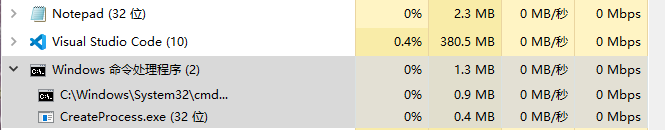

# 软件项目安全开发生命周期 CreateProcess
###### 17软工 刘明洋 201711143013
---

## 1. 准备过程
### 实验源码
``` C
#include <windows.h>
#include <stdio.h>
#include <tchar.h>

void _tmain(int argc, TCHAR* argv[])
{
	STARTUPINFO si;
	PROCESS_INFORMATION pi;

	ZeroMemory(&si, sizeof(si));
	si.cb = sizeof(si);
	ZeroMemory(&pi, sizeof(pi));

	if (argc != 2)
	{
		printf("Usage: %s [cmdline]\n", argv[0]);
		return;
	}

	// Start the child process. 
	if (!CreateProcess(NULL,   // No module name (use command line)
		argv[1],        // Command line
		NULL,           // Process handle not inheritable
		NULL,           // Thread handle not inheritable
		FALSE,          // Set handle inheritance to FALSE
		0,              // No creation flags
		NULL,           // Use parent's environment block
		NULL,           // Use parent's starting directory 
		&si,            // Pointer to STARTUPINFO structure
		&pi)           // Pointer to PROCESS_INFORMATION structure
		)
	{
		printf("CreateProcess failed (%d).\n", GetLastError());
		return;
	}

	// Wait until child process exits.
	WaitForSingleObject(pi.hProcess, INFINITE);

	// Close process and thread handles. 
	CloseHandle(pi.hProcess);
	CloseHandle(pi.hThread);
}
```
### 程序功能
在命令行中运行此程序，后接的参数可以一段代表一个进程的命令行（最简单的即为一个可执行文件的名字），然后该程序会创建一个进程来执行这一段命令行。

## 2. 实验过程
+ 将源码编译连接，生成可执行文件（命名为 "CreateProcess.exe"）。
+ 打开任务管理器和 cmd。
+ 以 notepad 为例，在 cmd 中执行 CreateProcess.exe notepad，可以看到 notepad 被打开。
+ 观察任务管理器，进程数从 217 增加到了 219（cmd 创建 CreateProcess 进程，CreateProcess 进程创建 notepad 进程），在进程选项中，可以观察到多出的着两个进程。
  


+ 关闭 notepad，可以在任务管理器中看到进程 CreateProcess 和 notepad 全部被关闭。