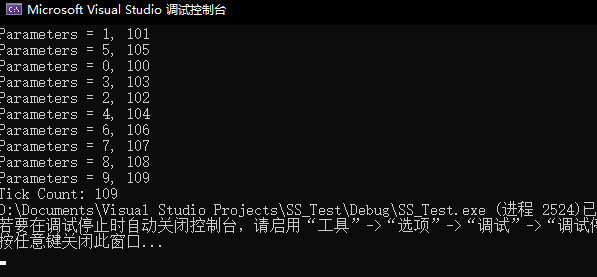
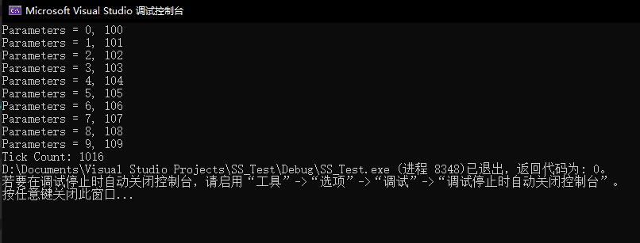

# 软件项目安全开发生命周期 CreateThread
###### 17软工 刘明洋 201711143013
---

## 1. 准备过程
### 实验源码
``` C
#include <windows.h>
#include <tchar.h>
#include <strsafe.h>

#define MAX_THREADS 10
#define BUF_SIZE 255

DWORD WINAPI MyThreadFunction(LPVOID lpParam);

// Sample custom data structure for threads to use.
// This is passed by void pointer so it can be any data type
// that can be passed using a single void pointer (LPVOID).
typedef struct MyData {
	int val1;
	int val2;
} MYDATA, * PMYDATA;


int _tmain()
{
	PMYDATA pDataArray[MAX_THREADS];
	DWORD   dwThreadIdArray[MAX_THREADS];
	HANDLE  hThreadArray[MAX_THREADS];

	// Create MAX_THREADS worker threads.

	int start = GetTickCount();

	for (int i = 0; i < MAX_THREADS; i++)
	{
		// Allocate memory for thread data.

		pDataArray[i] = (PMYDATA)HeapAlloc(GetProcessHeap(), HEAP_ZERO_MEMORY,
			sizeof(MYDATA));

		if (pDataArray[i] == NULL)
		{
			// If the array allocation fails, the system is out of memory
			// so there is no point in trying to print an error message.
			// Just terminate execution.
			ExitProcess(2);
		}

		// Generate unique data for each thread to work with.

		pDataArray[i]->val1 = i;
		pDataArray[i]->val2 = i + 100;

		// Create the thread to begin execution on its own.

		hThreadArray[i] = CreateThread(
			NULL,                   // default security attributes
			0,                      // use default stack size  
			MyThreadFunction,       // thread function name
			pDataArray[i],          // argument to thread function 
			0,                      // use default creation flags 
			&dwThreadIdArray[i]);   // returns the thread identifier 


		// Check the return value for success.
		// If CreateThread fails, terminate execution. 
		// This will automatically clean up threads and memory. 

		if (hThreadArray[i] == NULL)
		{
			printf("Create Thread Error");
			ExitProcess(3);
		}

	} // End of main thread creation loop.

	// Wait until all threads have terminated.

	WaitForMultipleObjects(MAX_THREADS, hThreadArray, TRUE, INFINITE);
	int end = GetTickCount();
	printf("Tick Count: %d", end - start);

	// Close all thread handles and free memory allocations.

	for (int i = 0; i < MAX_THREADS; i++)
	{
		CloseHandle(hThreadArray[i]);
		if (pDataArray[i] != NULL)
		{
			HeapFree(GetProcessHeap(), 0, pDataArray[i]);
			pDataArray[i] = NULL;    // Ensure address is not reused.
		}
	}

	return 0;
}


DWORD WINAPI MyThreadFunction(LPVOID lpParam)
{
	HANDLE hStdout;
	PMYDATA pDataArray;

	// Make sure there is a console to receive output results. 

	hStdout = GetStdHandle(STD_OUTPUT_HANDLE);
	if (hStdout == INVALID_HANDLE_VALUE)
		return 1;

	// Cast the parameter to the correct data type.
	// The pointer is known to be valid because 
	// it was checked for NULL before the thread was created.

	pDataArray = (PMYDATA)lpParam;

	// Print the parameter values using thread-safe functions.

	printf("Parameters = %d, %d\n",
		pDataArray->val1, pDataArray->val2);

	Sleep(100);

	return 0;
}
```
### 程序功能
程序会创建 10 个线程同时打印各自的数据，线程在打印后会暂停 100 ticks，然后结束。最后程序会输出从创建所有进程到所有进程运行结束经过的 ticks。
#### 运行结果

可见经过的 tick 数为 109，并且线程打印的顺序是随机的。
修改源码，将其改成一个单线程程序，基本功能同上。
``` C
#include <windows.h>
#include <tchar.h>
#include <strsafe.h>

#define MAX_THREADS 10
#define BUF_SIZE 255

DWORD WINAPI MyThreadFunction(LPVOID lpParam);

// Sample custom data structure for threads to use.
// This is passed by void pointer so it can be any data type
// that can be passed using a single void pointer (LPVOID).
typedef struct MyData {
	int val1;
	int val2;
} MYDATA, * PMYDATA;


int _tmain()
{
	PMYDATA pDataArray[MAX_THREADS];

	// Create MAX_THREADS worker threads.

	int start = GetTickCount();

	for (int i = 0; i < MAX_THREADS; i++)
	{
		// Allocate memory for thread data.

		pDataArray[i] = (PMYDATA)HeapAlloc(GetProcessHeap(), HEAP_ZERO_MEMORY,
			sizeof(MYDATA));

		if (pDataArray[i] == NULL)
		{
			// If the array allocation fails, the system is out of memory
			// so there is no point in trying to print an error message.
			// Just terminate execution.
			ExitProcess(2);
		}

		// Generate unique data for each thread to work with.

		pDataArray[i]->val1 = i;
		pDataArray[i]->val2 = i + 100;

		MyThreadFunction(pDataArray[i]);
	} // End of main thread creation loop.

	int end = GetTickCount();
	printf("Tick Count: %d", end - start);

	return 0;
}


DWORD WINAPI MyThreadFunction(LPVOID lpParam)
{
	HANDLE hStdout;
	PMYDATA pDataArray;

	// Make sure there is a console to receive output results. 

	hStdout = GetStdHandle(STD_OUTPUT_HANDLE);
	if (hStdout == INVALID_HANDLE_VALUE)
		return 1;

	// Cast the parameter to the correct data type.
	// The pointer is known to be valid because 
	// it was checked for NULL before the thread was created.

	pDataArray = (PMYDATA)lpParam;

	// Print the parameter values using thread-safe functions.

	printf("Parameters = %d, %d\n",
		pDataArray->val1, pDataArray->val2);

	Sleep(100);

	return 0;
}
```
#### 运行结果

可见，运行的 tick 数变为了 1016（每个线程 sleep 100，10 个则 1000），并且打印的顺序是固定的，和声明的顺序相同。
